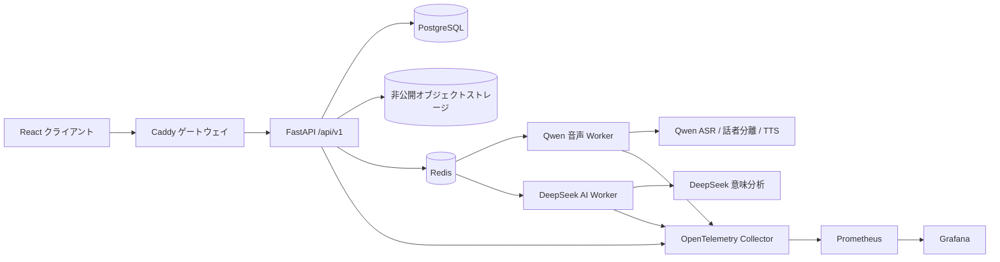

# Wordseek

> 実際の会話を、根拠のある振り返りと次の練習へ。

[English](README.md) · [简体中文](README.zh-CN.md) · [日本語](README.ja.md)

Wordseek は **Beyond Words** アプリケーションの GitHub リポジトリ名です。学習者が、参加者の同意を得た実際の会話を録音し、話者別の文字起こし、本人話者の確認、発話根拠に基づく振り返り、目的別の練習まで行えるようにします。

既存のデータベースおよびデプロイ設定との互換性を保つため、一部の画面には `Beyond Words`、内部識別子には `beyond_words` という名称が残っています。

## プロダクトの流れ

1. ユーザーがアカウントを作成し、参加者の同意を得た会話を録音またはアップロードします。
2. 録音は非公開ストレージに保存されます。クラウド音声処理は録音ごとの許可後にのみ開始されます。
3. Qwen がタイムスタンプ、文字起こし、1～8 人の匿名話者分離を返します。
4. ユーザーが「自分はどの話者か」を明示的に選択し、文章や話者割り当てを修正できます。
5. 発話時間、発話比率、ターン数を集計し、各所見を元の発話へ関連付けます。
6. 意味分析を有効にした場合、匿名化済みの文字起こしだけを DeepSeek に送ります。音声は送りません。
7. 振り返り、場面分析、3 問の練習問題、回答へのフィードバックを生成します。
8. ユーザーは自分のデータをエクスポートまたは削除できます。

## 主な機能

| 分野 | 現在の実装 |
|---|---|
| アカウント | Argon2id、サーバー側セッション、HttpOnly Cookie、CSRF、任意の OIDC |
| 音声 | 長時間録音は Qwen Filetrans、短い練習回答は Qwen Flash |
| 話者分離 | 1～8 人の匿名話者分離と、ユーザーによる本人話者の最終確認 |
| 振り返り | DeepSeek による要約、場面分析、根拠付き所見、出題、回答フィードバック |
| 練習 | テキスト・音声回答、TTS 再生、履歴保存、シナリオ会話 |
| 教材言語 | 英語・中国語はローカライズ済み Taskmaster、日本語は選定済み RealPersonaChat |
| 保存 | 本番データは PostgreSQL、音声は非公開の S3 互換オブジェクトストレージ |
| 非同期処理 | Celery + Redis、`speech` と `default` キューを分離 |
| 管理 | ユーザー、ジョブ、モデル使用量、監査ログ、システム状態、安全な再試行 |
| 可観測性 | 構造化ログ、Request ID、OpenTelemetry、Prometheus、Grafana、Exporter |

## システム設計



本番環境の音声経路は Qwen のみです。Whisper、faster-whisper、pyannote、ローカル CPU/GPU 選択、ローカルへのフォールバックは、過去の技術資料として `archive/local-speech-provider/` に保存されています。本番コードからの import、ビルド、起動、自動フォールバックは行いません。

意味分析には DeepSeek を使用します。DeepSeek が受け取るのは匿名化済みの発話テキストだけで、元の録音は受け取りません。

## 技術スタック

- **フロントエンド:** React 18、TypeScript、Vite、React Router、TanStack Query、Zustand
- **API:** FastAPI、Pydantic、バージョン付き `/api/v1`
- **データ:** PostgreSQL、SQLAlchemy 2、Alembic。SQLite は分離されたローカル開発・テスト専用
- **ジョブ:** Celery 5、Redis 7
- **オブジェクトストレージ:** 非公開 S3 互換ストレージ。Compose では MinIO API 互換の Silo を使用
- **音声モデル:** `qwen-audio-3.1-asr-flash-filetrans`、`qwen-audio-3.1-asr-flash`、`qwen3-tts-flash`
- **意味モデル:** DeepSeek Chat Completions。既定の設定名は `deepseek-flash`
- **セキュリティ:** Argon2id、HttpOnly/SameSite Cookie、CSRF、`owner_id` 分離、レート制限、監査ログ
- **運用:** Docker Compose、Caddy、OpenTelemetry、Prometheus、Grafana、PostgreSQL/Redis Exporter

## リポジトリ構成

```text
backend/app/api/           バージョン付き HTTP / WebSocket API
backend/app/services/      音声処理、保存、認証、匿名化、TTS、声紋サービス
backend/app/speech/        現在有効な Qwen Provider
backend/app/ai/            DeepSeek クライアント、Schema、根拠検証、キャッシュ
backend/app/repositories/  owner_id で分離されたデータアクセス
backend/app/workers/       Celery 設定とバックグラウンドタスク
backend/app/data/          アプリに同梱する読み取り専用の練習カタログ
migrations/versions/       Alembic マイグレーション
src/                       React アプリケーション
deploy/                    Caddy、OpenTelemetry、Prometheus、Grafana 設定
evaluation/                公開コーパス評価ツールと過去のベースライン
archive/                   本番で使用しない過去の実装
docs/                      アーキテクチャ、デプロイ、引き継ぎ、検証資料
```

## クイックスタート：本番相当のユーザーテスト

エンドユーザーとして確認する場合に推奨するモードです。ブラウザをユーザー端末、Docker をアプリケーションサーバーとして扱います。

### 必要なもの

- Docker Desktop と Docker Compose
- 音声機能用の Qwen DashScope 認証情報
- 振り返り機能用の DeepSeek 認証情報

リポジトリを取得します。

```bash
git clone https://github.com/entity003official/Wordseek.git
cd Wordseek
```

`.env.example` を `.env` にコピーし、例示用のパスワードをすべて変更します。その後、Compose が参照するモデル用シークレットを作成します。

```text
api-key/dashscope_api_key.txt   Qwen / DashScope API Key
api-key/api-key.txt             DeepSeek API Key
```

`api-key/` は Git と Docker のビルドコンテキストから除外されています。実際の認証情報をコミットしないでください。

Windows でユーザーテスト環境を起動します。

```powershell
powershell -ExecutionPolicy Bypass -File scripts/start_user_test.ps1
```

アクセス先：

- ユーザー画面: `http://127.0.0.1:18080/`
- 管理画面: `http://127.0.0.1:18080/admin`
- Grafana: `http://127.0.0.1:13000/`

データベースとオブジェクトストレージのボリュームを残したまま停止します。

```powershell
powershell -ExecutionPolicy Bypass -File scripts/stop_user_test.ps1
```

## ローカル開発

Node.js 20+、Python 3.10+、FFmpeg が必要です。

```powershell
npm install
python -m venv .venv
.\.venv\Scripts\python.exe -m pip install -r backend\requirements.txt
.\.venv\Scripts\alembic.exe upgrade head
.\.venv\Scripts\python.exe -m uvicorn backend.app.main:app --reload --port 8000
```

別のターミナルで実行します。

```powershell
npm run dev
```

フロントエンドは `http://localhost:5173`、API ドキュメントは `http://localhost:8000/api/docs` です。

## 管理者アカウント

Docker 環境の起動後、次のコマンドで管理者を作成または昇格できます。

```powershell
docker compose -f docker-compose.yml -f docker-compose.user-test.yml exec api `
  python -m backend.app.cli create-admin `
  --email admin@example.com `
  --password "replace-with-a-strong-password" `
  --name "System Administrator"
```

管理画面では運用メタデータを扱いますが、ユーザーの録音、全文文字起こし、プロンプト、モデルの完全な出力を閲覧する機能は提供しません。

## 検証

```powershell
npm test
npm run build
python -m unittest discover -s backend/tests -v
powershell -ExecutionPolicy Bypass -File scripts/verify_enterprise.ps1
```

自動テストは Mock とローカルの固定データを使用し、有料モデルを呼び出しません。Qwen と DeepSeek の実環境テストは、権限、残高、想定費用を確認したうえで明示的に実行してください。

## プライバシーと安全上の境界

- 参加者の同意を確認した後にのみ録音を開始します。
- Qwen へ送信する前に、録音ごとの個別許可が必要です。
- DeepSeek へ送るのは匿名化済みの文字起こしだけで、音声は送りません。
- セッション、ジョブ、練習、AI 生成結果、エクスポートは `owner_id` で分離します。
- 管理者が確認できるのは運用メタデータであり、会話本文ではありません。
- 声紋照合は利便機能であり、認証や高保証の本人確認ではありません。
- 1 回の会話から、人格、動機、感情、心理状態、総合的な語学力を推定しません。
- ログに API Key、一時音声 URL、全文文字起こし、プロンプト、モデルの完全な出力を残しません。

## 練習データと帰属表示

- 組み込み英語教材には Taskmaster-1 の選定済みタスク指向対話を使用し、データセットの CC BY 4.0 条件に従います。
- 日本語教材には独立した読み取り専用カタログの RealPersonaChat を使用し、出典と CC BY-SA 4.0 表示を保持します。
- JMultiWOZ はローカルのライセンス状態を確認するまで、ユーザー向けカタログに含めません。
- 元データセット全体を本番イメージへ同梱しません。

選定基準とデータ境界は、[練習カタログ統合資料（中国語）](docs/日语对话素材练习库接入说明.md)および[評価資料（中国語）](evaluation/README.zh-CN.md)を参照してください。

## ドキュメント

- [中文 README](README.zh-CN.md)
- [アーキテクチャとコードマップ（中国語）](docs/技术架构与功能实现.md)
- [音声モデル統合記録（中国語）](docs/语音模型选择与接入计划.md)
- [ローカル受け入れテスト手順（中国語）](docs/本地真实用户验收指南.md)
- [最終検証レポート（中国語）](docs/最终验收报告-20260926.md)

## プロジェクトの状態

Wordseek は開発中のハッカソンプロジェクト兼リファレンス実装です。一般公開の本番運用前に、実モデルでの受け入れテスト、障害復旧訓練、本番シークレットのローテーション、データセットおよびプロジェクトライセンスの最終確認が必要です。

## ライセンスと連絡先

プロジェクトのソースコードには [Apache License 2.0](LICENSE) が適用されます。第三者データセット、モデルサービス、依存関係には、それぞれのライセンスと利用規約が適用されます。

連絡先: [entity.003.official@gmail.com](mailto:entity.003.official@gmail.com)
