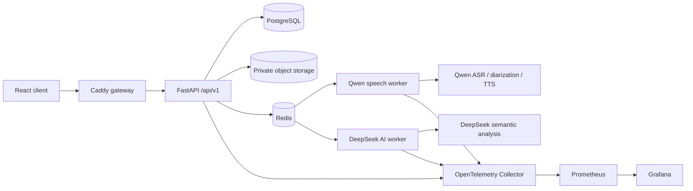

# Wordseek

> Turn real conversations into evidence-based review and deliberate practice.

[English](README.md) · [简体中文](README.zh-CN.md) · [日本語](README.ja.md)

Wordseek is the GitHub repository for the **Beyond Words** application. It helps language learners record a consented conversation, obtain speaker-aware transcription, verify which speaker is themselves, review evidence-linked interaction patterns, and continue learning through targeted practice.

Some UI text and runtime identifiers still use `Beyond Words` or the `beyond_words` prefix for data and deployment compatibility.

## What it does

1. A user registers and records or uploads a conversation with participant consent.
2. The recording is stored privately. Cloud speech processing starts only after per-recording authorization.
3. Qwen produces timestamps, transcription, and anonymous diarization for one to eight speakers.
4. The user confirms “which speaker is me” and may correct text or speaker assignments.
5. The application calculates participation metrics and presents observations linked to exact turns.
6. If semantic analysis is enabled, only a redacted transcript—not audio—is sent to DeepSeek.
7. The user receives a review, scene analysis, three targeted exercises, and answer feedback.
8. The user can export or delete their own data.

## Main capabilities

| Area | Current implementation |
|---|---|
| Accounts | Argon2id passwords, opaque server sessions, HttpOnly cookies, CSRF, optional OIDC |
| Speech | Qwen Filetrans for long recordings, Qwen Flash for short practice answers |
| Speaker separation | Anonymous 1–8 speaker diarization followed by explicit user confirmation |
| Semantic review | DeepSeek summaries, scene analysis, evidence-linked observations, exercises and feedback |
| Practice | Text or voice answers, TTS playback, saved attempts, scenario conversations |
| Languages | English and Chinese localized Taskmaster material; curated Japanese RealPersonaChat material |
| Storage | PostgreSQL for production data and private S3-compatible object storage for audio |
| Background work | Celery and Redis with separate `speech` and `default` queues |
| Administration | User and job management, model usage, audit logs, health status and safe retry |
| Observability | Structured logs, request IDs, OpenTelemetry, Prometheus, Grafana and exporters |

## System design



The active production speech path is Qwen only. Whisper, faster-whisper, pyannote, local CPU/GPU selection, and local fallback logic are retained solely under `archive/local-speech-provider/` as historical engineering material. They are not imported, built, started, or used as a fallback.

DeepSeek is the semantic provider. It receives redacted transcript turns only and never receives the original recording.

## Technology stack

- **Frontend:** React 18, TypeScript, Vite, React Router, TanStack Query, Zustand
- **API:** FastAPI and Pydantic under `/api/v1`
- **Data:** PostgreSQL, SQLAlchemy 2, Alembic; isolated SQLite for local development and tests
- **Jobs:** Celery 5 and Redis 7
- **Object storage:** private S3-compatible storage; Docker Compose uses Silo with the MinIO API
- **Speech:** Qwen `qwen-audio-3.1-asr-flash-filetrans`, `qwen-audio-3.1-asr-flash`, `qwen3-tts-flash`
- **Semantic AI:** DeepSeek Chat Completions, configured as `deepseek-flash` by default
- **Security:** Argon2id, HttpOnly/SameSite cookies, CSRF, owner-scoped queries, rate limits, audit logs
- **Operations:** Docker Compose, Caddy, OpenTelemetry, Prometheus, Grafana, PostgreSQL/Redis exporters

## Repository layout

```text
backend/app/api/           Versioned HTTP and WebSocket endpoints
backend/app/services/      Speech orchestration, storage, auth, redaction, TTS, voiceprint
backend/app/speech/        Active Qwen provider integration
backend/app/ai/            DeepSeek client, schemas, evidence validation and caching
backend/app/repositories/  Owner-scoped data access
backend/app/workers/       Celery configuration and background tasks
backend/app/data/          Read-only practice catalogs shipped with the application
migrations/versions/       Alembic database migrations
src/                       React application
deploy/                    Caddy, OpenTelemetry, Prometheus and Grafana configuration
evaluation/                Public-corpus evaluation tooling and historical baselines
archive/                   Inactive historical implementations
docs/                      Architecture, deployment, handoff and verification documents
```

## Quick start: production-like user test

This mode is recommended when testing the product as an end user. The browser represents the user device; Docker represents the application server.

### Requirements

- Docker Desktop with Compose
- Qwen DashScope credentials for speech features
- DeepSeek credentials for semantic review features

Clone and enter the repository:

```bash
git clone https://github.com/entity003official/Wordseek.git
cd Wordseek
```

Copy `.env.example` to `.env`, replace every example secret, then create the provider secret files expected by Compose:

```text
api-key/dashscope_api_key.txt   Qwen / DashScope API key
api-key/api-key.txt             DeepSeek API key
```

The `api-key/` directory is excluded from Git and Docker build contexts. Never commit real credentials.

On Windows, start the complete user-test environment:

```powershell
powershell -ExecutionPolicy Bypass -File scripts/start_user_test.ps1
```

Open:

- User application: `http://127.0.0.1:18080/`
- Admin console: `http://127.0.0.1:18080/admin`
- Grafana: `http://127.0.0.1:13000/`

Stop the environment while preserving database and object-storage volumes:

```powershell
powershell -ExecutionPolicy Bypass -File scripts/stop_user_test.ps1
```

## Local development

Requirements: Node.js 20+, Python 3.10+, and FFmpeg.

```powershell
npm install
python -m venv .venv
.\.venv\Scripts\python.exe -m pip install -r backend\requirements.txt
.\.venv\Scripts\alembic.exe upgrade head
.\.venv\Scripts\python.exe -m uvicorn backend.app.main:app --reload --port 8000
```

In a second terminal:

```powershell
npm run dev
```

Open `http://localhost:5173`. The API documentation is available at `http://localhost:8000/api/docs`.

## Administrator account

After the Docker environment is running, create or promote an administrator with:

```powershell
docker compose -f docker-compose.yml -f docker-compose.user-test.yml exec api `
  python -m backend.app.cli create-admin `
  --email admin@example.com `
  --password "replace-with-a-strong-password" `
  --name "System Administrator"
```

The admin console intentionally does not provide access to user recordings, full transcripts, prompts, or complete model outputs.

## Verification

```powershell
npm test
npm run build
python -m unittest discover -s backend/tests -v
powershell -ExecutionPolicy Bypass -File scripts/verify_enterprise.ps1
```

The automated suite uses mocks and local fixtures. It does not make paid provider calls. Live Qwen and DeepSeek acceptance tests must be run explicitly with authorized accounts and an understood cost budget.

## Privacy and safety boundaries

- Recording begins only after the user confirms participant consent.
- Every recording requires separate authorization before it is sent to Qwen.
- DeepSeek receives redacted transcript text only; it does not receive audio.
- Sessions, jobs, practice attempts, AI generations, and exports are scoped by `owner_id`.
- Administrators can inspect operational metadata, not private conversation content.
- Voiceprint matching is a convenience feature, not authentication or high-assurance identity verification.
- The application does not infer personality, motivation, emotion, mental state, or overall language ability from a single conversation.
- Logs must not contain API keys, temporary audio URLs, full transcripts, prompts, or complete model output.

## Practice data and attribution

- Selected Taskmaster-1 task-oriented dialogs are used for the bundled English practice catalog under the dataset's CC BY 4.0 terms.
- Curated Japanese RealPersonaChat material is stored in a separate read-only catalog with source and CC BY-SA 4.0 attribution.
- JMultiWOZ is intentionally excluded from the user-facing catalog until its local license status is verified.
- The full source datasets are not shipped inside the production image.

See [practice catalog integration](docs/日语对话素材练习库接入说明.md) and [evaluation notes](evaluation/README.zh-CN.md) for the selection and safety rules.

## Documentation

- [Chinese full guide](README.zh-CN.md)
- [Japanese full guide](README.ja.md)
- [Architecture and implementation map](docs/技术架构与功能实现.md)
- [Speech provider implementation record](docs/语音模型选择与接入计划.md)
- [Local user acceptance guide](docs/本地真实用户验收指南.md)
- [Latest verification report](docs/最终验收报告-20260926.md)

## Project status

Wordseek is an actively developed hackathon project and reference implementation. Before a public production launch, complete live-provider acceptance tests, disaster-recovery drills, production secret rotation, and a final legal review of dataset and project licensing.

## License and contact

The project source is licensed under the [Apache License 2.0](LICENSE). Third-party datasets, model services, and dependencies retain their respective licenses and terms.

Contact: [entity.003.official@gmail.com](mailto:entity.003.official@gmail.com)
