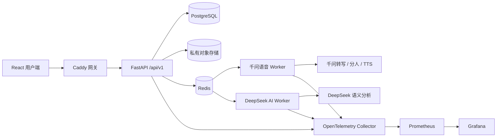

# Wordseek

> 把真实对话转化为有证据的复盘和可继续的练习。

[English](README.md) · [简体中文](README.zh-CN.md) · [日本語](README.ja.md)

Wordseek 是 **Beyond Words** 应用的 GitHub 仓库名称。它面向语言学习者，帮助用户记录一段参与者已知情同意的真实对话，完成多人转写、本人身份确认、证据化复盘和针对性练习。

为了兼容现有数据库与部署配置，部分界面仍显示 `Beyond Words`，部分内部标识继续使用 `beyond_words` 前缀。

## 产品解决什么问题

1. 用户注册账号，录制或上传一段已获得参与者同意的对话。
2. 录音先进入私有存储；只有用户对本段录音单独授权后，才会进行云端语音处理。
3. 千问返回时间戳、转写文本和 1～8 位匿名说话人分离结果。
4. 用户明确选择“哪位说话人是我”，并可修正文句或说话人归属。
5. 系统统计发言时长、占比和话轮，并将互动观察关联到具体原始话轮。
6. 用户开启语义分析后，后端只把脱敏转写发送给 DeepSeek，不发送音频。
7. 系统生成复盘、场景分析、三道针对性练习题和回答反馈。
8. 用户可以导出或删除属于自己的数据。

## 主要能力

| 领域 | 当前实现 |
|---|---|
| 账号 | Argon2id 密码、服务端不透明会话、HttpOnly Cookie、CSRF、可选 OIDC |
| 语音 | 千问 Filetrans 处理长录音，千问 Flash 处理短练习录音 |
| 说话人分离 | 1～8 位匿名说话人分离，最终身份由用户确认 |
| 语义复盘 | DeepSeek 总结、场景分析、证据化观察、出题和回答反馈 |
| 练习 | 文字或语音回答、TTS 朗读、历史记录、场景陪练 |
| 语言素材 | 英语和中文使用本地化 Taskmaster 素材；日语使用精选 RealPersonaChat 素材 |
| 数据与音频 | 生产数据使用 PostgreSQL，音频进入私有 S3 兼容对象存储 |
| 后台任务 | Celery + Redis，`speech` 与 `default` 队列分开 |
| 管理后台 | 用户、任务、模型用量、审计、系统状态和安全重试 |
| 运行监控 | 结构化日志、请求 ID、OpenTelemetry、Prometheus、Grafana 与 Exporter |

## 系统设计



生产语音链路只使用千问。Whisper、faster-whisper、pyannote、本地 CPU/GPU 选择和本地回退逻辑仅作为历史技术资料保存在 `archive/local-speech-provider/`，不会被生产代码导入、构建、启动或自动回退。

DeepSeek 是语义模型，只接收经过脱敏的转写话轮，不接收原始录音。

## 技术栈

- **前端：** React 18、TypeScript、Vite、React Router、TanStack Query、Zustand
- **接口：** FastAPI、Pydantic，统一版本前缀 `/api/v1`
- **数据：** PostgreSQL、SQLAlchemy 2、Alembic；SQLite 只用于隔离的本机开发与测试
- **异步任务：** Celery 5、Redis 7
- **对象存储：** 私有 S3 兼容存储；Compose 使用兼容 MinIO API 的 Silo
- **语音模型：** `qwen-audio-3.1-asr-flash-filetrans`、`qwen-audio-3.1-asr-flash`、`qwen3-tts-flash`
- **语义模型：** DeepSeek Chat Completions，默认配置名为 `deepseek-flash`
- **安全：** Argon2id、HttpOnly/SameSite Cookie、CSRF、`owner_id` 隔离、限流、审计日志
- **部署监控：** Docker Compose、Caddy、OpenTelemetry、Prometheus、Grafana、PostgreSQL/Redis Exporter

## 代码目录

```text
backend/app/api/           版本化 HTTP 与 WebSocket 接口
backend/app/services/      语音编排、存储、认证、脱敏、TTS 和声纹服务
backend/app/speech/        当前使用的千问 Provider
backend/app/ai/            DeepSeek 客户端、Schema、证据校验与缓存
backend/app/repositories/  带 owner_id 的数据访问封装
backend/app/workers/       Celery 配置和后台任务
backend/app/data/          随应用交付的只读练习素材库
migrations/versions/       Alembic 数据库迁移
src/                       React 应用
deploy/                    Caddy、OpenTelemetry、Prometheus 和 Grafana 配置
evaluation/                公开语料评测工具和历史基线
archive/                   不参与生产运行的历史实现
docs/                      架构、部署、交接与验收文档
```

## 快速启动：模拟真实用户

这是推荐的产品验收方式：浏览器代表用户设备，Docker 代表企业 Linux 服务器。

### 前置要求

- Docker Desktop 与 Docker Compose
- 用于语音功能的千问 DashScope 凭据
- 用于语义复盘的 DeepSeek 凭据

克隆仓库：

```bash
git clone https://github.com/entity003official/Wordseek.git
cd Wordseek
```

将 `.env.example` 复制为 `.env`，替换所有示例密码；然后创建 Compose 读取的模型密钥文件：

```text
api-key/dashscope_api_key.txt   千问 / DashScope API Key
api-key/api-key.txt             DeepSeek API Key
```

`api-key/` 已被 Git 和 Docker 构建上下文排除。不要把真实密钥提交到仓库。

Windows 下启动完整验收环境：

```powershell
powershell -ExecutionPolicy Bypass -File scripts/start_user_test.ps1
```

访问入口：

- 用户端：`http://127.0.0.1:18080/`
- 管理后台：`http://127.0.0.1:18080/admin`
- Grafana：`http://127.0.0.1:13000/`

停止服务但保留数据库与对象存储卷：

```powershell
powershell -ExecutionPolicy Bypass -File scripts/stop_user_test.ps1
```

## 本机开发

需要 Node.js 20+、Python 3.10+ 和 FFmpeg。

```powershell
npm install
python -m venv .venv
.\.venv\Scripts\python.exe -m pip install -r backend\requirements.txt
.\.venv\Scripts\alembic.exe upgrade head
.\.venv\Scripts\python.exe -m uvicorn backend.app.main:app --reload --port 8000
```

新开一个终端：

```powershell
npm run dev
```

前端地址是 `http://localhost:5173`，API 文档是 `http://localhost:8000/api/docs`。

## 创建管理员

Docker 环境启动后，运行：

```powershell
docker compose -f docker-compose.yml -f docker-compose.user-test.yml exec api `
  python -m backend.app.cli create-admin `
  --email admin@example.com `
  --password "请替换为强密码" `
  --name "系统管理员"
```

管理后台只提供账号、任务、用量、审计和运行状态管理，不提供查看用户录音、完整转写、提示词或模型完整输出的入口。

## 自动验证

```powershell
npm test
npm run build
python -m unittest discover -s backend/tests -v
powershell -ExecutionPolicy Bypass -File scripts/verify_enterprise.ps1
```

自动测试使用 Mock 和本地固定数据，不会调用付费模型。真实千问和 DeepSeek 验收必须由开发者显式执行，并提前确认账号余额、授权范围和预期费用。

## 隐私与安全边界

- 用户确认参与者已知情同意后才开始录音。
- 每段录音发送给千问前都需要单独授权。
- DeepSeek 只接收脱敏转写，不接收音频。
- 会话、任务、练习、AI 结果与导出均通过 `owner_id` 隔离。
- 管理员可以查看运行元数据，但不能查看用户对话正文。
- 声纹匹配只用于便利性，不是账号认证或高安全身份识别。
- 不根据一次对话推断人格、动机、情绪、心理状态或综合语言水平。
- 日志不得记录 API Key、临时音频地址、完整转写、提示词或模型完整输出。

## 练习数据与署名

- 内置英语练习使用 Taskmaster-1 中经过筛选的任务型对话，遵循数据集的 CC BY 4.0 条款。
- 日语练习使用独立只读库中的精选 RealPersonaChat 素材，并保留来源与 CC BY-SA 4.0 署名。
- JMultiWOZ 在本地许可证状态核验完成前，不进入用户练习库。
- 完整源数据集不会进入生产镜像。

筛选规则和数据边界见[日语对话素材练习库接入说明](docs/日语对话素材练习库接入说明.md)与[评测说明](evaluation/README.zh-CN.md)。

## 项目文档

- [日本語 README](README.ja.md)
- [技术架构与代码地图](docs/技术架构与功能实现.md)
- [语音模型接入记录](docs/语音模型选择与接入计划.md)
- [本地真实用户验收指南](docs/本地真实用户验收指南.md)
- [最终验收报告](docs/最终验收报告-20260926.md)
- [后端技术与实现说明（Word）](docs/Beyond%20Words%20后端技术与实现说明.docx)

## 当前状态

Wordseek 当前是持续开发中的黑客松项目和参考实现。公开生产发布前仍应完成真实模型验收、服务器故障恢复演练、生产密钥轮换，以及数据集和项目许可证的最终法律核对。

## 许可证与联系

项目源码采用 [Apache License 2.0](LICENSE)。第三方数据集、模型服务和依赖继续适用各自的许可证与服务条款。

联系邮箱：[entity.003.official@gmail.com](mailto:entity.003.official@gmail.com)
